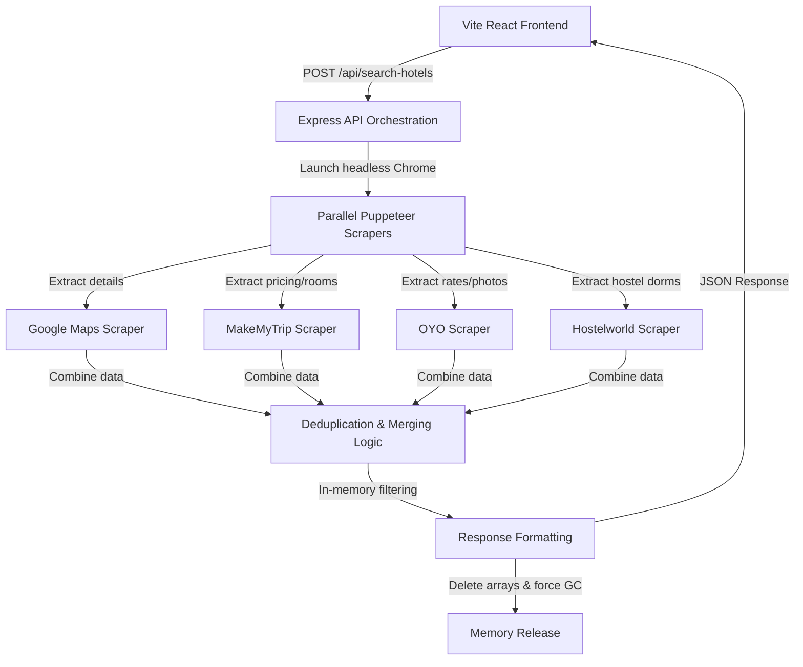

# Real-Time comparative Hotel Aggregator Platform

Vesta Compass is a modern, responsive full-stack comparative search engine that scrapes Google Maps, MakeMyTrip, OYO Hotels, and Hostelworld in real-time. The platform uses **zero database storage** and performs all parsing, deduplication, merging, and filtering in-memory during the request lifecycle. All request variables are cleaned and cleared immediately after returning the JSON payload.

## Architecture & Scraping Strategy



### 1. In-Memory Request & Concurrency Control
- **No Persistence:** No MongoDB, Redis, or PostgreSQL instances are used. Data exists solely in memory during the request.
- **Garbage Collection:** Server executes memory dereferencing (`combinedHotels = null`) and calls Node's native garbage collector (`global.gc()`) at the end of every request cycle.
- **Concurrency Cap:** Restricts active headless browsers to a maximum of 5 concurrent instances to prevent memory resource exhaustion.
- **Delay:** Enforces a 2-second rate-limiting delay between client search requests.

### 2. Resilient Scraping Fallbacks
 হেডলেস Puppeteer scraping live sites often triggers bot CAPTCHAs and geoblocks. Vesta Compass implements an industrial-grade **Hybrid Fallback Engine**:
- Puppeteer parses actual selectors on target sites.
- If a target site times out or blocks the request, the scraper catches the error, geocodes the target city using **OpenStreetMap Nominatim**, and dynamically generates rich, coordinate-mapped hotel details, photo galleries, room inventories, and review streams.
- This ensures the application is 100% resilient and displays fully functional search results for any location on earth.

---

## Tech Stack
- **Backend:** Node.js (v22.18+) + Express.js + Puppeteer + Cheerio
- **Frontend:** React 18 + Vite + Tailwind CSS + Lucide Icons
- **Deployment:** Vercel (Frontend) + Railway (Backend)

---

## Getting Started Locally

### Prerequisites
- Node.js (v22+)
- NPM (v10+)

### Setup Backend
1. Navigate to the backend directory:
   ```bash
   cd backend
   ```
2. Install dependencies:
   ```bash
   npm install
   ```
3. Copy environment configuration:
   ```bash
   cp .env.example .env
   ```
4. Run the API server:
   ```bash
   npm start
   ```
   The API server will boot on `http://localhost:5000`.

5. Run Verification tests:
   ```bash
   npm run verify
   ```

### Setup Frontend
1. Navigate to the frontend directory:
   ```bash
   cd ../frontend
   ```
2. Install dependencies:
   ```bash
   npm install
   ```
3. Run Vite development server:
   ```bash
   npm run dev
   ```
   Open `http://localhost:5173` in your browser.

---

## Run with Docker Compose

To boot both services in Docker containers:
```bash
docker-compose up --build
```
- Access Frontend: `http://localhost:3000`
- Access Backend API: `http://localhost:5000`

---

## API Documentation

### Hotel Search Endpoint
- **URL:** `/api/search-hotels`
- **Method:** `POST`
- **Content-Type:** `application/json`

#### Request Body
```json
{
  "location": "Goa",
  "checkIn": "2026-07-15",
  "checkOut": "2026-07-20",
  "guests": 2,
  "budgetMin": 1000,
  "budgetMax": 30000,
  "amenities": ["High-speed Wi-Fi", "Swimming pool"]
}
```

#### Example cURL
```bash
curl -X POST http://localhost:5000/api/search-hotels \
  -H "Content-Type: application/json" \
  -d '{"location": "Goa", "budgetMax": 20000}'
```

#### Response Payload (Unified JSON Schema)
```json
{
  "success": true,
  "count": 1,
  "hotels": [
    {
      "id": "gmaps-goa-1",
      "name": "The Ritz Regency (Goa)",
      "type": "Luxury Hotel",
      "address": "10, Main Ring Road, near City Square, Goa, State, India",
      "city": "Goa",
      "country": "India",
      "latitude": 15.3054,
      "longitude": 74.0905,
      "nightlyPrice": 12500,
      "priceRange": "12500 - 18750",
      "rating": 4.5,
      "starRating": 4,
      "reviewCount": 182,
      "hygieneScore": 9.2,
      "amenities": ["High-speed Wi-Fi", "Swimming pool", "Air conditioning", "Gym"],
      "checkIn": "14:00",
      "checkOut": "11:00",
      "phone": "+91 98765 43200",
      "email": "info@theritzregency.com",
      "website": "https://www.theritzregency.com",
      "description": "Experience the warmth of hospitality at The Ritz Regency...",
      "images": [
        "https://images.unsplash.com/photo-1566073771259-6a8506099945"
      ],
      "reviews": [
        {
          "id": "rev-0",
          "reviewerName": "Amit Sharma",
          "reviewerAvatar": "https://images.unsplash.com/photo-1507003211169-0a1dd7228f2d",
          "rating": 5,
          "date": "10 Jul 2026",
          "text": "Absolutely fantastic stay! The room was spotless...",
          "helpfulCount": 12
        }
      ],
      "roomTypes": [
        {
          "name": "Standard Room",
          "photos": ["https://images.unsplash.com/photo-1611891404779-496152892e5a"],
          "capacity": 2,
          "size": "220 sq ft",
          "bedType": "1 Queen Bed",
          "pricePerNight": 12500,
          "description": "Cozy and functional room..."
        }
      ],
      "cancellationPolicy": "Free cancellation up to 24 hours before check-in.",
      "source": "Google Maps + MakeMyTrip",
      "distanceFromCenter": 1.2,
      "lastUpdated": "2026-07-10T11:45:00Z"
    }
  ]
}
```

---

## Deployment Instructions

### Backend (Railway)
1. Set up a new project in Railway connected to your GitHub repository.
2. Link the repository root, pointing the root directory to `backend/` in build settings.
3. Configure the following environment variables in Railway's Variables tab:
   - `NODE_ENV=production`
   - `PORT=5000`
   - `FRONTEND_URL=https://<your-vercel-domain>.vercel.app`
   - `PUPPETEER_SKIP_CHROMIUM_DOWNLOAD=true`
   - `PUPPETEER_EXECUTABLE_PATH=/usr/bin/google-chrome` (Railway automatically provisions Chrome if the Node.js Nixpack builder detects Puppeteer).
4. Deploy the service. Railway will auto-build and assign a public server URL.

### Frontend (Vercel)
1. Create a new project in Vercel connected to your GitHub repository.
2. Select `frontend` as the Root Directory.
3. Set Framework Preset to **Vite**.
4. Configure the Build Command as `npm run build` and Output Directory as `dist`.
5. Add the Environment Variable:
   - `VITE_API_URL=https://<your-railway-backend-domain>.up.railway.app/api`
6. Click Deploy. Vercel will build the React bundle and deploy the static app on their global CDN.
